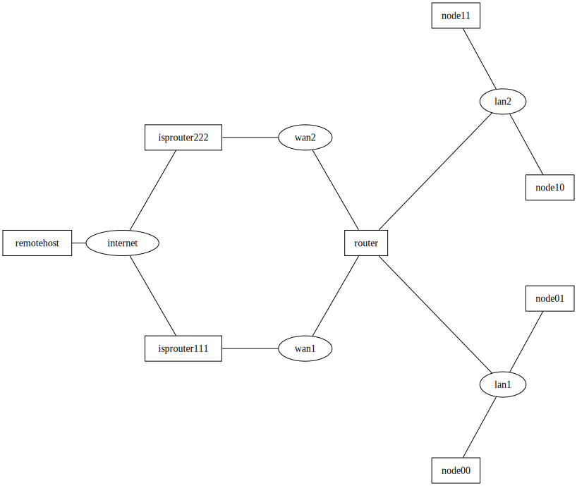

# Example network topology for Crazy Polenta

This repository uses [Kathara] to create the following network topology in order to address [this question]:

[this question]: https://serverfault.com/questions/1164687/using-multiple-tables-to-route-ips-from-two-isps



(Nodes are boxes, networks are ovals)

## Usage

1. Install [Kathara]
2. From inside this repository, run `kathara lstart`
3. Use `kathara connect` to connect to virtual hosts:

    ```
    kathara connect router
    ```

[kathara]: https://www.kathara.org/
